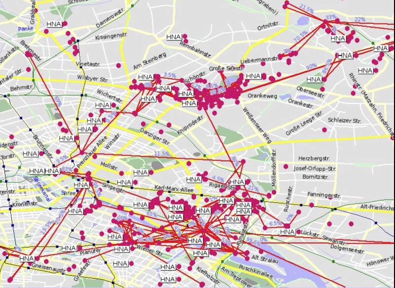
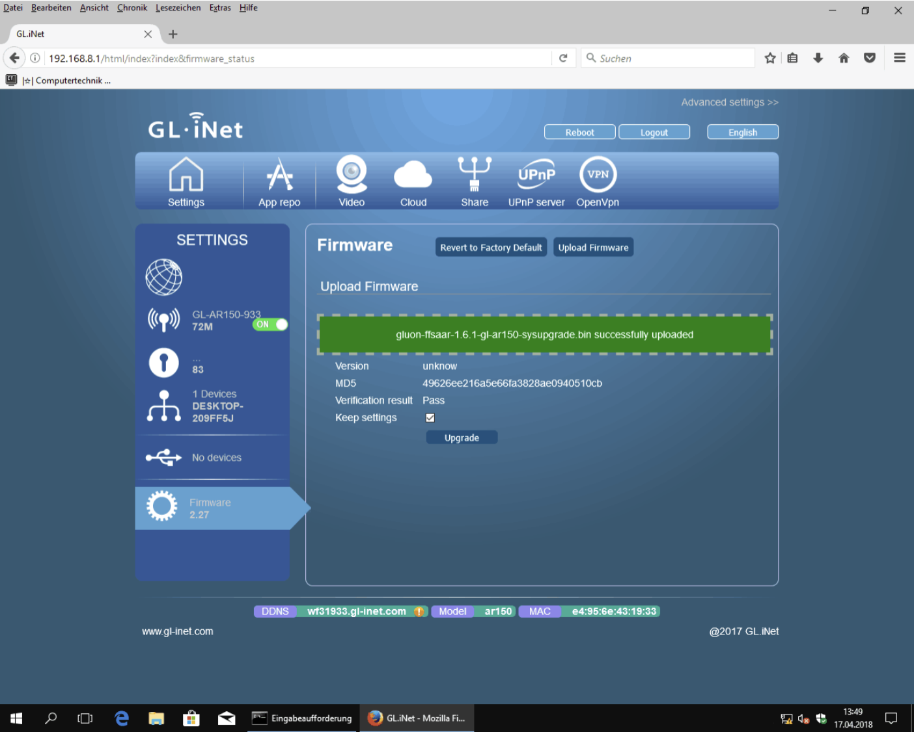
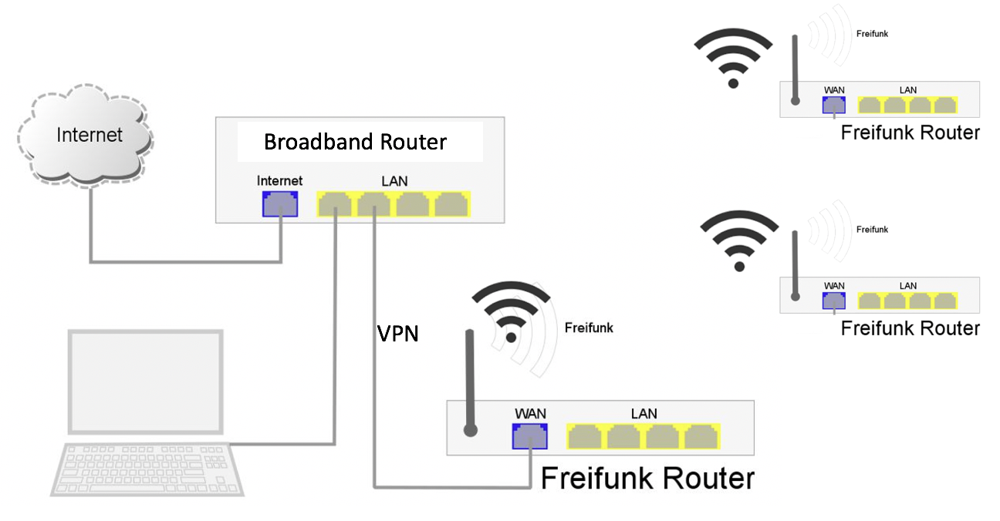
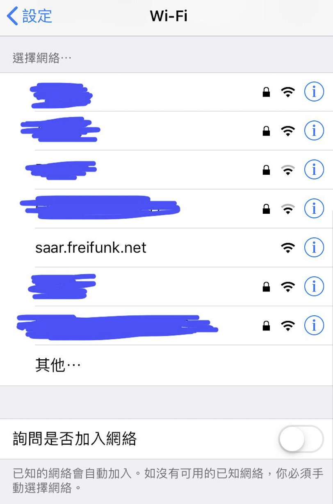
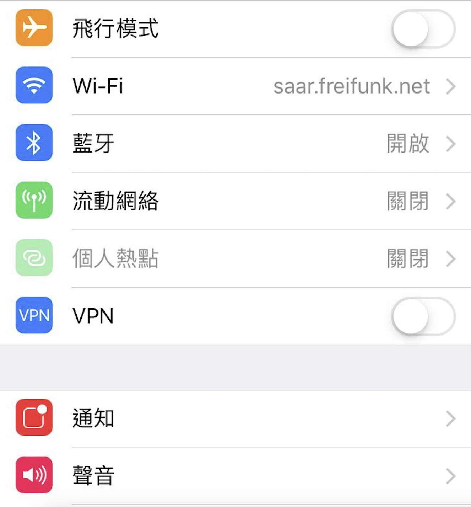
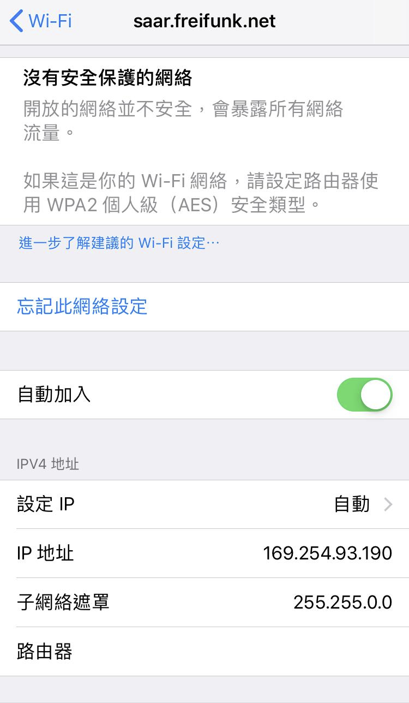
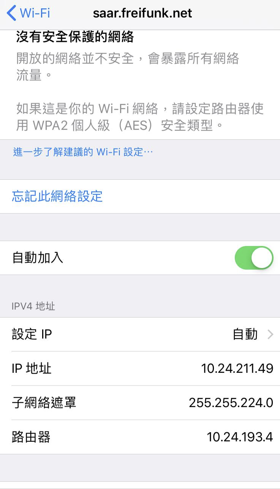
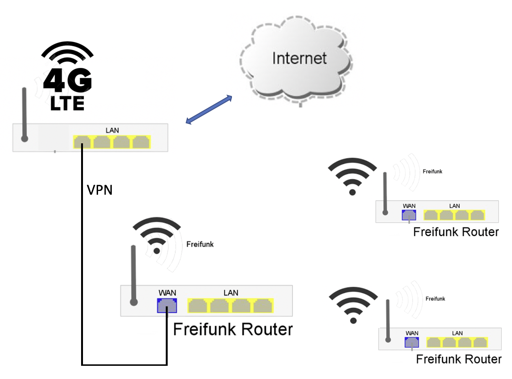
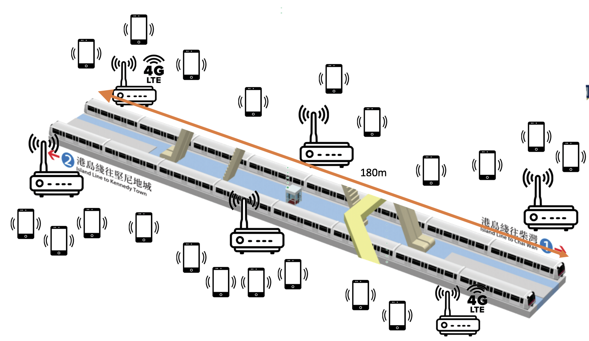

# Freifunk 

This repository is in chinese only.  

香港現在言論自由不斷收窄，好多網民己經使用 VPN 上網，特別是在使用社交媒體時，來保護他們的在線隱私和個人數據 。隨着時間到來，中國的「防火長城」相信會延伸至香港。更甚者可能針對反抗的聲音，甚至可能斷網，絕對控制網上言論自由空間。 

我不是網路專家，但希望可以分享我認識的科技，使更多人加入討論及試用。VPN 的使用我不再說了，因為網上已經有很多有關資訊。萬一真的斷網了，我們仍有沒有比較安全的上網方法?   這裹想介绍 Freifunk Mesh Network 。Freifunk  Mesh Network 與 FireChat 及 Bridgefy 有些相似的地方，大家都是以 Mesh 的方法建網，但 Freifunk 實行方法就有很大的分别 。 我不會說 Freifunk 是最强最安全，大家各有長短。以下是我所知道的分别給大家參考: 

a)  FireChat - 手機 App、方便以、藍芽、Wi-Fi 方式建網，發射及接收距離 (說有 10米 ) 受手機硬件限制，只可做短距離並且手機數目要集中  
b)  Bridgefy  - 手機 App、方便、以藍芽、Wi-Fi 方式建網，發射及接收距離 (說有 100米, 不過實測是沒有的 ) 受手機硬件限制，只可做短距離並且手機數目要集中 
c)  Freifunk  - Router Firmware,不是手機 App,以 Wi-Fi 及 LAN 方式建網, 發射距離由不同類型 Router 提供，有些户外 Router 發射及接收距離甚至可以去到幾公里遠 (視線距離 line of sight distance )，透過 VPN 及 Gateway 可以建立更大的網絡。另外 Mesh 網絡是以 Router 建網， 一個 Router 可以連接多過一部手機及電腦，由於 Gateway 及 Freifunk Router 遮擋了用户的身份, 外界不能見到他們真正IP 地址, 信息傳送及接收是加密的 。 
 
Freifunk（德語：“Free Radio”）旨在德國以去中心化型式免費提供 Wi-Fi 網絡，發展已經有十多年的歷史，技術及基礎設施都很成熟。 該計劃涉及大約400個本地社區，擁有超過 41,000 個接入點 (Node)。其中以 Münster、 Aachen、Munich、Stuttgart 及 Paderborn 是最大的社區，每個社區都有1000多個接入點。 

Freifunk Mesh 網絡地圖例子。每一個紅點是 Node。Node 可以是 Router 或 Gateway,  

Freifunk 是基於 OpenWrt 及 Wi-Fi Mesh Networking 的原理，以 BATMAN Advanced Routing 技術進行。每個人只需要購買一個支援 Freifunk 的 Router 並安裝 Freifunk Firmware 就可以不必依賴 ISP 互聯網公司供應商而自行建網, 在斷網下都可進行溝通。睇完以下兩個 Youtube 影片介紹可以更了解其運作。 

[Youtube video] 
https://www.youtube.com/watch?v=2XQiLHJdYKE
https://www.youtube.com/watch?v=2Z12OjnPADA

Freifunk 大部份文件及討論內容都是以德文為主。幸好有 Google Translate 翻譯成英文才能明白内容。這篇文章主要以實用為主及希望讀者可跟隨步骤製作到 Freifunk Router。其他技術內容不會詳細解釋。如果想睇詳細的說明可以參考德文的網站 https://ctaas.de/OpenWrt_Freifunk_Router_GL-iNet.htm 及参考資料。 

A. 下載: 
Freifunk Wi-Fi 網絡在德國有 90% 使用 Gluon Framework 製作相同的 Router firmware. 由於每個 Router 都有獨特的硬件 ( e.g. CPU, Wireless Chip) 及每個 Wi-Fi 網絡都有自己獨特的設定 ( e.g. IP address range, gateway, site name ), 使用 Gluon 可有效管理唔同版本 firmware 的發佈. 我們香港將來都可以用相同方法製作自己的  Freifunk 網絡 。以下是德國其中薩爾邦 (Saarland) Freifunk 網絡所提供的 Router Firmware下載網址, 大家可以在這裡試試。

https://archive.saar.freifunk.net/firmware/1.8.0/factory/
https://archive.saar.freifunk.net/firmware/1.8.0/sysupgrade/

factory 及 sysupgrade 有乜分别? 我通常先試 sysupgrade 版本，唔得再試 factory。 ( 這裏有講分别 https://forum.openwrt.org/t/sysupgrade-vs-factory-image-upgrade/53317)

Freifunk 支援很多唔同牌子的 Router，包括 Buffalo，D-link，GL.iNet，Linksys，Netgear，TP-Link (最多). 當然不是每個型號及版本都支援，所以請大家睇清楚才購買

注意: 每個 firmware 只會適合對應的 Router 版本 ( 例如 TP-link Archer C7, 有五個版本, 如果你購買的是 version 5。請使用 gluon-ffsaar-1.8.0-tp-link-archer-c7-v5-sysupgrade.bin。 其他版本是不能用的)。所以在購買前要檢查清楚那個 router 版本才適用。

B. 安裝: 
参考 Saarland 網絡所提供的安裝資訊 (https://saar.freifunk.net/neue-hardware-empfehlung/)。 我會使用GL.iNet GL-AR150示範安裝過程。佢本身以 OpenWrt 為基楚, 支援Freifunk 度很高。安裝過程與平時新買 router 做設定一樣。 你需要一部有 LAN port 的 Notebook or PC. 如果無用 USB to LAN 設備都可以。將 Router 的 LAN port 連接 就可以做設定了。

1. 下載 Freifunk Firmware:  https://archive.saar.freifunk.net/firmware/1.8.0/sysupgrade/gluon-ffsaar-1.8.0-gl.inet-gl-ar150-sysupgrade.bin
2. 在 Router 的界面裏，在 Upload Firmware，Upload Freifunk  Firmware.  

3. 移除連接電腦及Router 的 LAN 線
4. 更新了Freifunk Firmware 的 Router 重新啟動後會自動進入 Mesh 模式，你用手機見到新的 SSID "saar.freifunk.net" 出現就代表成功了。

https://erfurt.freifunk.net/firmware-flashen/
https://www.slideshare.net/mariobehling/freifunk-praesentation-english
https://openwrt.org/toh/gl.inet/gl-ar150

C. 測試方法  

1. 室内有安裝寬頻上網:  

將家裏寬頻上網用 Router 的 LAN port 連接 Freifunk  Router 的 WAN port 就可以上網了

測試 Mesh Network 最好有三個或以上 Router 才可成事。假設你的 Freifunk  Router 放在家裏三個不同位置, 只要其中一個連上Internet. 其他位置的 Freifunk  Router 都可上網了。 你可能會發現其實同市面上的 Mesh Router ( e.g. Netgear Orbi ) 原理差不多, 只是不需入密碼 。

你只要使用手機 連上 其中一個 SSID  "saar.freifunk.net"  ( 每個 router 的 SSID 是一樣的 ),  唔需要密碼就能連接了, 就可以上網用 Facebook, Whatsapp, Youtube, Gmail 等 App. 手機無需安裝任可 App. 好似平用 Wi-Fi 或寬頻上網就可以了。
 

連上 SSID "saar.freifunk.net"  

記住關閉流動網絡, 確定只用 Wi-Fi 

如果只係見到以上 IP 地址: 169.254.93.190. 即表示你未能連上 Internet. 主要原困是沒有連上 Internet 的網節 Node. 請檢查其中一個 Freifunk Router 是否己經連接寬頻 Router.

 如果見到以上 IP 地址: 10.24.211.xx , 路由器有 IP 地址: 10.24.193.4. 表示你能連上 Internet 了.

2. 室外用 4G LTE Router 分享上網

室内可以用自己寬頻上網做測試. 但在室外情况就需要用 4G LTE Router  再分享給 Freifunk  Router. 
整個 Mesh Network 會因你的 Internet 連線而上到網. 你其實做了 Gateway 的角式, 帶動其他人上網, 所以我建議你用不記名的太空 4G SIM Card 比較安全分享給其他人使用。

你需要兩個 Router , 一個是 4G LTE Router, 另一個 是Freifunk  Router 做 Mesh Network. 4G LTE Router要選擇有 LAN PORT 的, 另外最好有內置電池甚至可以供電給另外一個 Freifunk  Router 使用, 4G LTE Router 入張 4G 大空 SIM Card, LAN Port 連接 Freifunk  Router WAN Port 就完成了.

以下是4G LTE Router 供参考:

NETGEAR Nighthawk M2 , HK$3,680  
NETGEAR Nighthawk M1,  HK$2,288
NETGEAR AirCard AC810, HK$1,782
GL.iNET 4G Smart Router GL-MiFi ( 需注明 EP06-E module for Hong Kong  ) HK$1,100

                        
3. 地鐵返工放工 繁忙時段測試
Mesh Network 需要大量的 Node 才能成事。 如果大家有興趣一齊試,  我建議可以係繁忙時段搭地鐵時大家開着 Freifunk  Router 試試 Mesh Network 得唔得。如果你有更好的方法使一班人短時間 出來試 Mesh Network 歡迎提出呀。

a. 大家約一個或幾個時間. 例如 早上8:30, 9:00, 9:30, 搭邊條線 , 或係邊個站,  地鐵站月台及列車長度大約 180 米. 只要你在車頭、中間及車尾就可成事.    
b. 你有兩個角色可以做. 
    -  做 Gateway Node ( 4G LTE Router + Freifunk  Router), 分享 4G 上網
    -  做 Node Only (Freifunk  Router), 建立 Mesh網絡, 給其他手機或手提電腦上網
 
c. 去 FB/TG 報告情況
 

D. 私隱及網絡安全

Freifunk 網絡分了三個層面通訊. 

1.  Freifunk Router  與手機/電腦之間連線 - 形成自己的網絡, 只有連接同一個 Freifunk router 的手機或電腦才可看到大家 IP 地址。視乎router 的硬件 ( CPU, RAM), 一個 router 大約可支援5-10 部手機或電腦同時上網. 同一個網絡是沒有加密, 需要自己手機加强保安 ( e.g. 網址要有HTTPS,  用支援 end-to-end encryption App - "WhatsApp, Signal, Telegram",  安裝 NordVPN...等 )

2.  Freifunk Routers  之間的 Mesh 網絡連線 -   Freifunk Routers 是支援 Layer 2 routing 技術。所有信息在這個 Mesh 網絡互傳, 每個 Node 只傳送最近 Node 的信息, 沒有一個Node 可以收集所有信息

3.  Freifunk 網絡 與 Internet 的連線 -  Freifunk 網絡 與 Internet 的連線中間需要透過  Gateway 進行通訊 。 這個 Gateway 以 VPN 連接 Internet 或 其他 Freifunk Gateway. 用户手機/電腦的 IP 地址是隱藏的. 不過與其他網絡一樣, 所有信息都會經這個Gateway連接

Freifunk 強項是建網, 即使沒有 Internet, 網絡內的手機/電腦可以各自通訊。但網絡安全方面仍需要用户自己留意 。因為世上没有最安全的網絡, 不論使用VPN , FireChat, Bridgefy 或 Freiunk 網絡, 如果你不注意自己的上網習慣, 一樣容易暴露自己的行蹤。

VPN 的作用是避開 ISP 網路服務供應商的追蹤，或將您的瀏覽歷史記錄交給廣告商、政府機構和其他第三方。VPN會將您的網路流量重新導引至一個特別設定的 VPN 伺服器，隱藏您的 IP 地址並將所有發送或接收的資料進行加密。對於攔截這些加密資料的人來說，加密資料基本上都是亂碼，使其無法被讀取。但是你用VPN上網時, Facebook 仍用舊帳戶發放敏感信息,  基本上有無用 VPN 是無分别; 另外是你的手機出賣你, 中國大陸的手機 及 APP更容易暴露行蹤。例如很多内地人用 VPN 或在 其他國家在 Twitter 發放敏感訊息, 但由於仍用微信 Webchat 等大陸 App 與朋友或家人溝通而暴露行蹤. 最好是用新手機丶新帳戶丶新太空 SIM ( 不記名 ) Card 丶不要亂安裝不知來歷的 App。小心打開有散播惡意程式網頁連結給駭客入侵 。
 
F. 參考資料
Freifunk Wiki
(德文, 用Google Translate 英文後閱讀無難度) 
https://de.wikipedia.org/wiki/Freifunk 

Performance analysis and simulation of a Freifunk Mesh network in Paderborn using B.A.T.M.A.N Advanced 
( 尼篇研究寫得非常好, 詳細講解Freifunk Mesh network 的運作及背後 BATMAN Routing 的原理 ) 
https://pdfs.semanticscholar.org/c58e/a767930720665ba89a89a9168be608e96c5e.pdf
  
Gluon Framework  
(製作 Firmware 的 Software, 日後可用來製作香港本區的 Freifunk  網絡  ) 
https://gluon.readthedocs.io/en/v2020.1.x/

4G LTE 設備選購指南 2020 
https://netgear.anlander.com/blogs/casestudy/4g-lte-mobile-router-best-choice 
https://www.price.com.hk/product.php?p=411907
 
Freifunk 社區 
https://freifunk.net/wie-mache-ich-mit/community-finden/

FireChat 沒有網路連線也能聊天的即時通訊App（iOS、Android） 
https://free.com.tw/firechat/

佔中通訊神器FireChat的安全隱患 
http://www.inmediahk.net/firechat
https://trier.freifunk.net/intranet-services/  

Facebook Nation: Total Information Awareness 
https://books.google.com.hk/books?id=JArZBAAAQBAJ

斷網都可互傳訊息 Bridgefy　 野餐好幫手！毋須Wi-Fi、手機網絡 
https://unwire.hk/2019/08/13/bridgefy/software/

【斷網必備】無網絡都可互傳訊息　盤點5大通訊神App 
https://www.hk01.com/%E5%AF%A6%E7%94%A8%E6%95%99%E5%AD%B8/385884/%E6%96%B7%E7%B6%B2%E5%BF%85%E5%82%99-%E7%84%A1%E7%B6%B2%E7%B5%A1%E9%83%BD%E5%8F%AF%E4%BA%92%E5%82%B3%E8%A8%8A%E6%81%AF-%E7%9B%A4%E9%BB%9E5%E5%A4%A7%E9%80%9A%E8%A8%8A%E7%A5%9Eapp

Bridgefy 離線藍牙發訊息app測試：效果不穩定、重要時刻不可靠 
https://www.hk01.com/%E6%95%B8%E7%A2%BC%E7%94%9F%E6%B4%BB/363929/bridgefy-%E9%9B%A2%E7%B7%9A%E8%97%8D%E7%89%99%E7%99%BC%E8%A8%8A%E6%81%AFapp%E6%B8%AC%E8%A9%A6-%E6%95%88%E6%9E%9C%E4%B8%8D%E7%A9%A9%E5%AE%9A-%E9%87%8D%E8%A6%81%E6%99%82%E5%88%BB%E4%B8%8D%E5%8F%AF%E9%9D%A0\

[https://whyweprotest.net/threads/how-to-build-a-diy-wifi-mesh-net-appliance-with-offshore-vpn-tunnel-using-freifunk-software-and-chea.111444/]
[https://freifunk-rothenburg.de/freifunk-fuer-gastronomie-handel-und-gewerbe/]

[https://pinneberg.freifunk.net/en/faq] 
Is my data safe?
For users of Freifunk applies: Every user of a WLAN is responsible for the protection of their own data in principle. The wireless access is unencrypted in the case of Freifunk. Because of this, you should take safety precautions by yourself or at least avoid controversial data transmission (for example bank transactions). What needs to be mentioned for your self protection are encrypted connections, which carry the characteristic HTTPS for websites (you can recognise it on the symbol of a lock in the address bar), and SSL/TLS for e-mails (gather information from your e-mail provider first). Ideally, you should build up your own VPN-connection to a service provider or your router at home. Also, the usage of Tor can improve your safety.

从Firechat软件追踪移动自组网技术发展 
https://blog.csdn.net/colcloud/article/details/41478217
