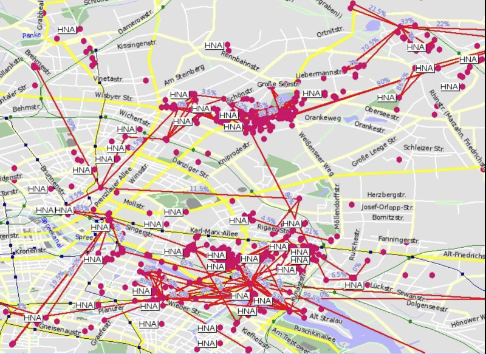
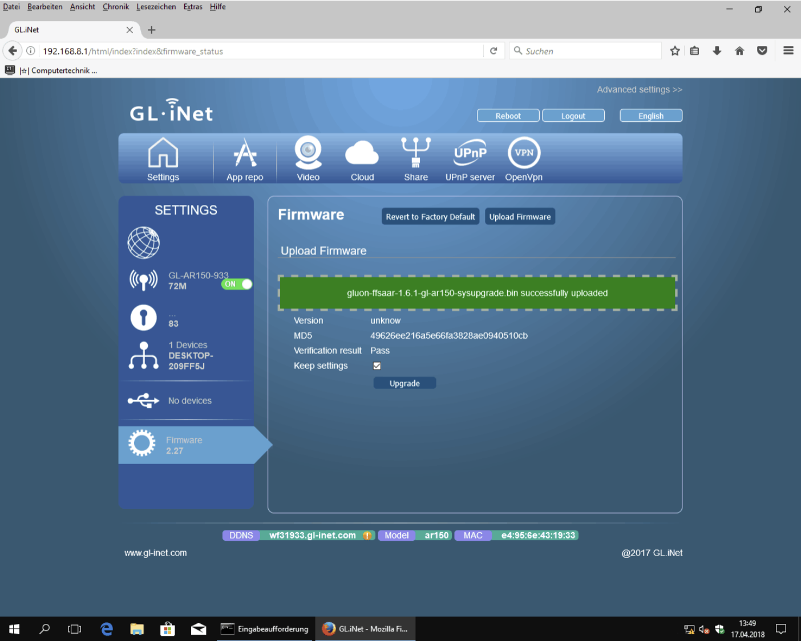
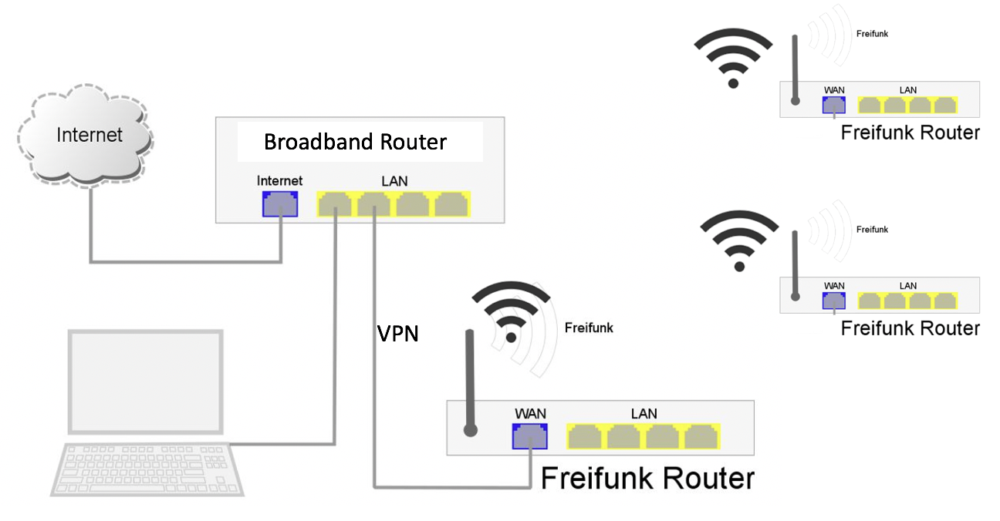
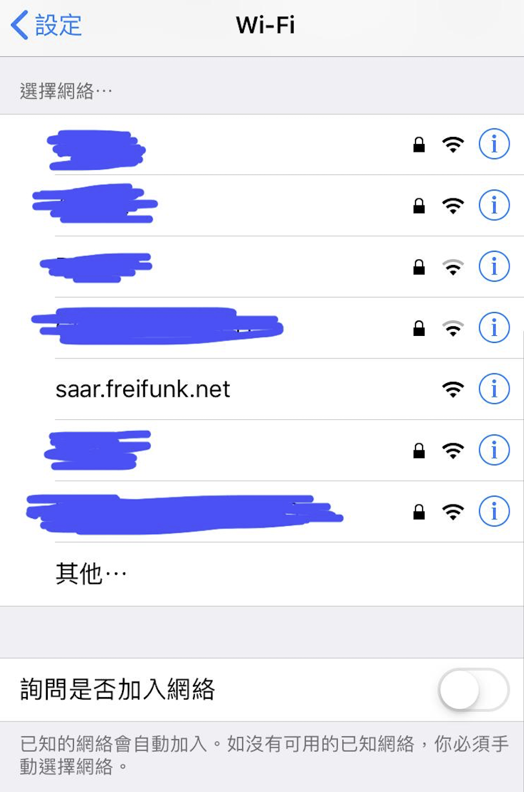
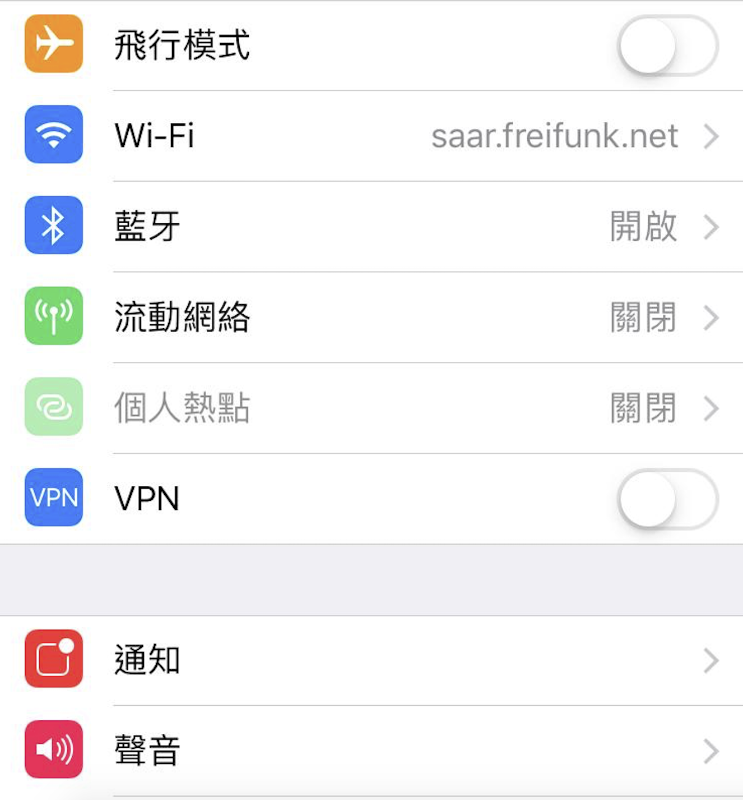
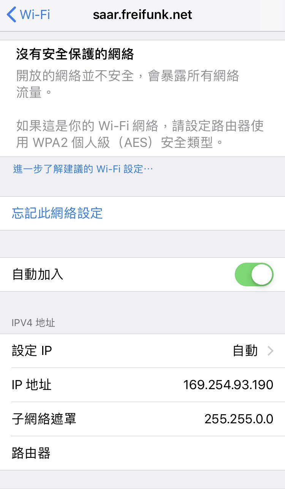
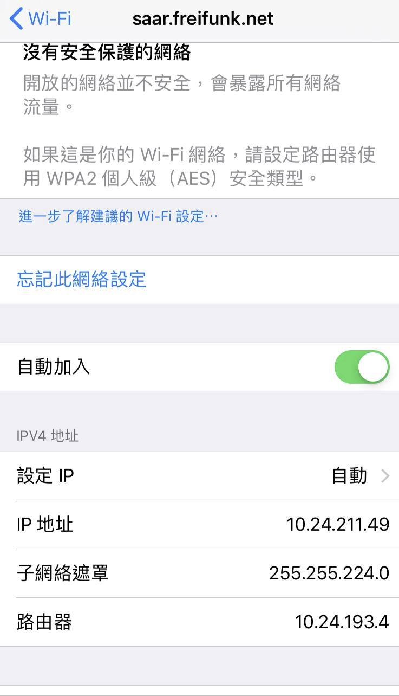
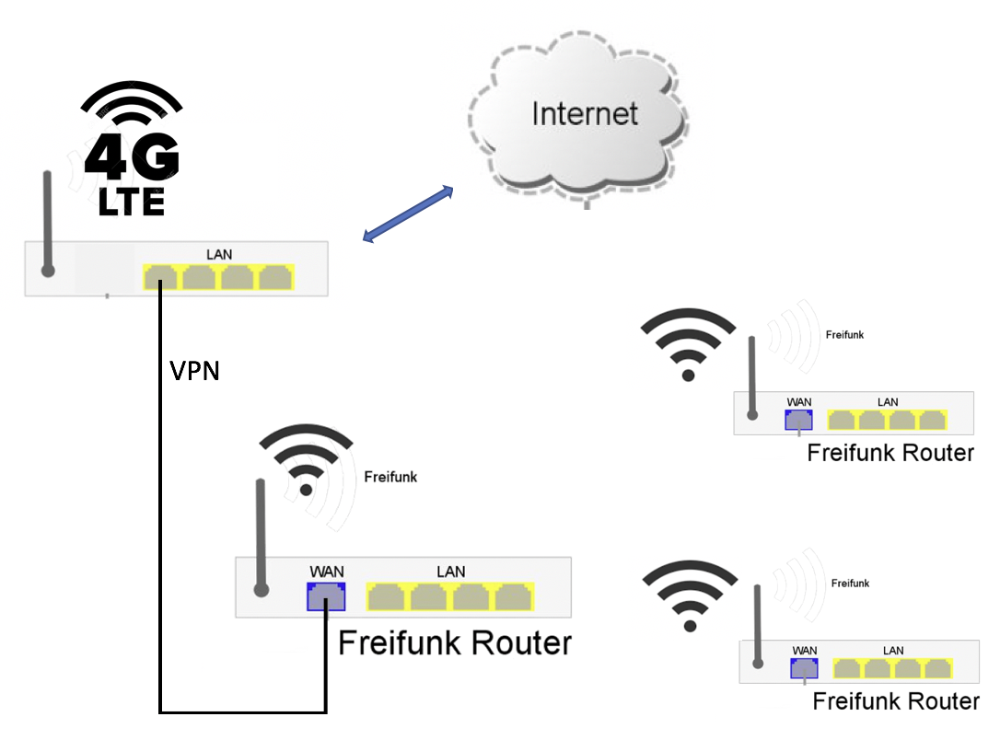
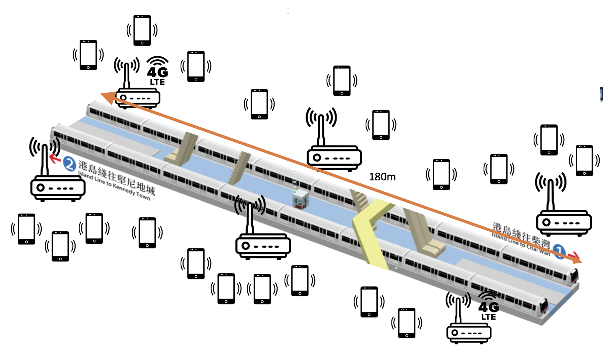

# Freifunk  

This repository is written in Chinese only.   

Freedom of speech in Hong Kong is becoming increasingly restricted. Many internet users are already using VPNs to access the internet—especially when using social media—in order to protect their online privacy and personal data. As time goes on, China’s “Great Firewall” will likely extend to Hong Kong. Worse still, it may specifically target dissenting voices, and could even cut off internet access entirely to gain absolute control over online speech.  

I’m not a network expert, but I hope to share the technologies I know so more people can join the discussion and try them out. I won’t talk more about VPN usage, because there is already a lot of information online. But if the internet really gets cut off, do we still have a safer way to go online? Here I want to introduce the **Freifunk Mesh Network**. Freifunk Mesh Network is somewhat similar to FireChat and Bridgefy in that they all use mesh networking, but Freifunk’s implementation is very different. I won’t claim Freifunk is the strongest or the safest—each has its own pros and cons. Below are the differences I know, for your reference: 

a) **FireChat** - Mobile app, convenient, builds a network via Bluetooth and Wi-Fi. Transmission and reception range (claimed ~10 meters) is limited by phone hardware, only suitable for short distances and requires many phones close together.   
b) **Bridgefy** - Mobile app, convenient, builds a network via Bluetooth and Wi-Fi. Transmission and reception range (claimed ~100 meters, but real-world tests don’t reach that) is limited by phone hardware, only suitable for short distances and requires many phones close together.   
c) **Freifunk** - Router firmware (not a mobile app). Builds a network via Wi-Fi and LAN. Range depends on router type; some outdoor routers can transmit and receive over several kilometers (line-of-sight distance). With VPN and gateways, it can form a much larger network. Also, since the mesh network is built with routers, one router can connect to multiple phones and computers. Because the gateway and Freifunk routers hide the user’s identity, outsiders cannot see their real IP address. Data transmission and reception are encrypted.   

Freifunk (German: “Free Radio”) aims to provide free Wi-Fi in a decentralized way in Germany. It has been developed for more than ten years, and its technology and infrastructure are very mature. The project involves around **400 local communities**, with more than **41,000 access points (nodes)**. The largest communities include Münster, Aachen, Munich, Stuttgart, and Paderborn, each with more than 1,000 access points. 

  
Example Freifunk mesh network map. Each red dot is a node. A node can be a router or a gateway.   

Freifunk is based on **OpenWrt** and **Wi-Fi mesh networking**, using **BATMAN Advanced Routing**. Anyone can buy a router that supports Freifunk and install Freifunk firmware, allowing them to build their own network without relying on an ISP internet provider, and still communicate even if the internet is cut off. Watching the two YouTube videos below will help you understand how it works. 

[Youtube video]   
https://www.youtube.com/watch?v=2XQiLHJdYKE   
https://www.youtube.com/watch?v=2Z12OjnPADA   

Most Freifunk documentation and discussions are mainly in German. Fortunately, Google Translate can translate it into English so we can understand it. This article focuses mainly on practical steps, hoping readers can follow along to make a Freifunk router. Technical details will not be explained in depth. If you want detailed explanations, you can refer to the German website https://ctaas.de/OpenWrt_Freifunk_Router_GL-iNet.htm and the reference materials. 

---

## A. Download:   

In Germany, about 90% of Freifunk Wi-Fi networks use the **Gluon Framework** to build router firmware. Because each router has unique hardware (e.g. CPU, wireless chip), and each Wi-Fi network has its own unique settings (e.g. IP address range, gateway, site name), Gluon helps manage publishing different firmware versions effectively. In the future, Hong Kong could also use the same method to create our own Freifunk network. Below are firmware download links provided by the Saarland (Saar) Freifunk network in Germany. You can try them out here:

https://archive.saar.freifunk.net/firmware/1.8.0/factory/   
https://archive.saar.freifunk.net/firmware/1.8.0/sysupgrade/   

What is the difference between factory and sysupgrade? I usually try the sysupgrade version first, and if it doesn’t work, then try factory. (Difference explained here: https://forum.openwrt.org/t/sysupgrade-vs-factory-image-upgrade/53317)

Freifunk supports many router brands, including Buffalo, D-link, GL.iNet, Linksys, Netgear, TP-Link (most common). Of course, not every model and version is supported, so please check carefully before buying.

**Note:** Each firmware only matches a specific router version (for example, TP-Link Archer C7 has five versions. If you bought version 5, you must use `gluon-ffsaar-1.8.0-tp-link-archer-c7-v5-sysupgrade.bin`. Other versions will not work). So before buying, make sure you check which router version is supported.

---

## B. Installation:   

Refer to Saarland network installation info (https://saar.freifunk.net/neue-hardware-empfehlung/). I will use the **GL.iNet GL-AR150** to demonstrate the installation process. It is based on OpenWrt and has strong Freifunk support. The installation process is similar to setting up a new router. You need a notebook or PC with a LAN port. If you don’t have one, you can use a USB-to-LAN adapter. Connect your computer to the router’s LAN port to configure it.

1. Download Freifunk firmware:  
   https://archive.saar.freifunk.net/firmware/1.8.0/sysupgrade/gluon-ffsaar-1.8.0-gl.inet-gl-ar150-sysupgrade.bin  
2. In the router interface, go to **Upload Firmware**, and upload the Freifunk firmware.  
  
3. Disconnect the LAN cable between the computer and the router.  
4. After rebooting with Freifunk firmware, the router will automatically enter mesh mode. If you see a new SSID **"saar.freifunk.net"** on your phone, it means success.

https://erfurt.freifunk.net/firmware-flashen/   
https://www.slideshare.net/mariobehling/freifunk-praesentation-english   
https://openwrt.org/toh/gl.inet/gl-ar150   

---

## C. Testing Methods    

### 1. Indoor test with broadband internet:  

Connect your home broadband router’s LAN port to the Freifunk router’s WAN port, then you can access the internet.  

To properly test a mesh network, it’s best to have **three or more routers**. Assume you place your Freifunk routers in three different locations at home. As long as one of them is connected to the internet, the Freifunk routers in other locations can also access the internet. You may notice it works similarly to commercial mesh routers (e.g. Netgear Orbi), except it doesn’t require a password.

You only need to connect your phone to the SSID **"saar.freifunk.net"** (all routers share the same SSID). No password is needed. Then you can browse the internet and use apps like Facebook, WhatsApp, YouTube, Gmail, etc. No app installation is required. It works like normal Wi-Fi broadband access.

  
 Connected to SSID "saar.freifunk.net"  

  
 Remember to turn off mobile data to ensure you are using Wi-Fi only  

  
 If you only see an IP address like `169.254.93.190`, it means you are not connected to the internet. The main reason is that there is no node connected to the internet. Please check whether one Freifunk router is already connected to the broadband router.

  
 If you see an IP address like `10.24.211.xx`, and the router has an IP address like `10.24.193.4`, it means you are connected to the internet.

---

### 2. Outdoor internet sharing using a 4G LTE router  

Indoor broadband is fine for testing. But outdoors, you need a 4G LTE router to share internet to the Freifunk router. The entire mesh network can go online through your internet connection. You are acting as a gateway, helping others get internet access, so I recommend using an anonymous prepaid 4G SIM card (unregistered) for safer sharing.

You need two routers: one 4G LTE router and one Freifunk router for the mesh network. The 4G LTE router should have a LAN port, and ideally a built-in battery and even the ability to power the Freifunk router. Insert the prepaid 4G SIM card into the 4G LTE router, then connect its LAN port to the Freifunk router’s WAN port.

Reference 4G LTE routers:

NETGEAR Nighthawk M2 , HK$3,680  
NETGEAR Nighthawk M1,  HK$2,288  
NETGEAR AirCard AC810, HK$1,782  
GL.iNET 4G Smart Router GL-MiFi (must specify EP06-E module for Hong Kong) HK$1,100  

---

### 3. Testing during busy hours on the subway (MTR)  

A mesh network needs many nodes to work well. If everyone is interested in testing together, I suggest turning on Freifunk routers during rush hour while riding the MTR to see if the mesh network works. If you have a better way to gather many people quickly to test the mesh network, feel free to suggest it.

a. Agree on one or more times, for example 8:30, 9:00, 9:30, which line or which station. A subway platform and train length is about 180 meters. If you have people at the front, middle, and back of the train, it could work.   
b. You can take two roles:  
   - Gateway Node (4G LTE router + Freifunk router), sharing 4G internet  
   - Node Only (Freifunk router), building the mesh network to provide internet to phones or laptops  
   
c. Report results on FB/TG  
   

---

## D. Privacy and Network Security  

Freifunk communication is divided into three layers:

### 1. Connection between Freifunk router and phone/computer  
This forms its own network. Only phones/computers connected to the same Freifunk router can see each other’s IP addresses. Depending on router hardware (CPU, RAM), one router can support about 5–10 devices online at the same time. This local network is not encrypted, so users must improve security on their own devices (e.g. only use HTTPS websites, use end-to-end encrypted apps like WhatsApp/Signal/Telegram, install NordVPN, etc.).

### 2. Mesh network connections between Freifunk routers  
Freifunk routers support Layer 2 routing. All data is transmitted through the mesh network. Each node only forwards information to the nearest node, and no single node can collect all traffic.

### 3. Connection between Freifunk network and the internet  
The Freifunk network connects to the internet through a gateway. The gateway connects via VPN to the internet or other Freifunk gateways. Users’ phone/computer IP addresses are hidden. However, like other networks, all traffic still passes through the gateway.

Freifunk’s strength is network building: even without the internet, phones and computers inside the network can still communicate. But network security still requires users to be careful. There is no “perfectly safe” network in the world. Whether you use VPN, FireChat, Bridgefy, or Freifunk, if you don’t pay attention to your online habits, it’s still easy to expose your identity and movements.

The purpose of a VPN is to avoid tracking by ISP providers, or prevent your browsing history from being handed over to advertisers, government agencies, and other third parties. A VPN redirects your traffic through a specially configured VPN server, hiding your IP address and encrypting all transmitted data. For anyone intercepting the encrypted data, it becomes unreadable gibberish.  

However, if you use a VPN but still post sensitive information on Facebook using your old account, using a VPN makes little difference. Also, your phone itself can expose you. Phones and apps from mainland China are more likely to leak information. For example, many people in China use VPNs or post sensitive messages on Twitter from other countries, but they still use WeChat or other mainland apps to communicate with friends and family, exposing themselves.  

The best practice is to use a new phone, new accounts, a new anonymous prepaid SIM card (unregistered), and avoid installing unknown apps. Be careful not to open malicious links that hackers can use to infect your device.

---

## F. References  

Freifunk Wiki  
(German, but easy to read after Google Translate to English)   
https://de.wikipedia.org/wiki/Freifunk  

Performance analysis and simulation of a Freifunk Mesh network in Paderborn using B.A.T.M.A.N Advanced  
(This research paper is very well written. It explains Freifunk mesh network operation and BATMAN routing principles in detail.)   
https://pdfs.semanticscholar.org/c58e/a767930720665ba89a89a9168be608e96c5e.pdf  

Gluon Framework  
(Software for building firmware. It can be used in the future to create a local Hong Kong Freifunk network.)   
https://gluon.readthedocs.io/en/v2020.1.x/  

4G LTE Device Buying Guide 2020   
https://netgear.anlander.com/blogs/casestudy/4g-lte-mobile-router-best-choice  
https://www.price.com.hk/product.php?p=411907  

Freifunk Communities   
https://freifunk.net/wie-mache-ich-mit/community-finden/  

FireChat: Instant messaging app that can chat without internet (iOS, Android)   
https://free.com.tw/firechat/  

Security concerns of FireChat during Occupy Central   
http://www.inmediahk.net/firechat  
https://trier.freifunk.net/intranet-services/  

Facebook Nation: Total Information Awareness   
https://books.google.com.hk/books?id=JArZBAAAQBAJ  

Bridgefy: Offline Bluetooth messaging app test (useful for picnics, no Wi-Fi or mobile network needed)   
https://unwire.hk/2019/08/13/bridgefy/software/  

[Must-have when internet is cut off] Offline messaging apps list: 5 major apps   
https://www.hk01.com/%E5%AF%A6%E7%94%A8%E6%95%99%E5%AD%B8/385884/%E6%96%B7%E7%B6%B2%E5%BF%85%E5%82%99-%E7%84%A1%E7%B6%B2%E7%B5%A1%E9%83%BD%E5%8F%AF%E4%BA%92%E5%82%B3%E8%A8%8A%E6%81%AF-%E7%9B%A4%E9%BB%9E5%E5%A4%A7%E9%80%9A%E8%A8%8A%E7%A5%9Eapp  

Bridgefy offline Bluetooth messaging test: unstable, unreliable in critical moments   
https://www.hk01.com/%E6%95%B8%E7%A2%BC%E7%94%9F%E6%B4%BB/363929/bridgefy-%E9%9B%A2%E7%B7%9A%E8%97%8D%E7%89%99%E7%99%BC%E8%A8%8A%E6%81%AFapp%E6%B8%AC%E8%A9%A6-%E6%95%88%E6%9E%9C%E4%B8%8D%E7%A9%A9%E5%AE%9A-%E9%87%8D%E8%A6%81%E6%99%82%E5%88%BB%E4%B8%8D%E5%8F%AF%E9%9D%A0\  

[https://whyweprotest.net/threads/how-to-build-a-diy-wifi-mesh-net-appliance-with-offshore-vpn-tunnel-using-freifunk-software-and-chea.111444/]  
[https://freifunk-rothenburg.de/freifunk-fuer-gastronomie-handel-und-gewerbe/]  

[https://pinneberg.freifunk.net/en/faq]   
Is my data safe?  
For Freifunk users: Every WLAN user is responsible for protecting their own data. Freifunk wireless access is unencrypted. Because of this, you should take safety precautions yourself, or at least avoid controversial data transmission (for example bank transactions). For self-protection, use encrypted connections such as HTTPS websites (recognizable by the lock icon in the address bar), and SSL/TLS for e-mails (check with your e-mail provider). Ideally, you should set up your own VPN connection to a service provider or your home router. Using Tor can also improve your safety.

Tracking the development of mobile ad-hoc networking from FireChat software   
https://blog.csdn.net/colcloud/article/details/41478217  

---------
